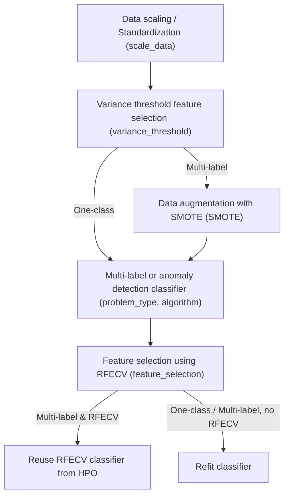

# Machine Learning (ML) pipeline for multilabel classification and one-class classification with feature selection and hyperparameter optimization
I developed these materials during my time as a student assistant at the FAPS institute at FAU Erlangen-Nürnberg.
## Script
`BuildAndTestClassifier.py` fits a multi-label or a one-class classifier and tests it
The script also performs hyperparameter optimization (HPO) for the underlying algorithm / model using [Optuna](https://optuna.readthedocs.io/en/stable/).
## How to run
```bash
python BuildAndTestClassifier.py --config [config]
```
with the following arguments:
- `--config`: Path to the config file.
- `--logging_level`: Optional. Default: INFO. The logging level for the Python logging module.
# General view of pipeline API in `BuildAndTestClassifier.py`
All parts of the pipeline can be turned on or off.


# Config parameters
The script uses config files in the yaml format (see the config examples)
## General parameters
|Parameter|Meaning|Example|
|------------|----------|---------|
|problem_type|One of _"multilabel"_, _"oneclass"_. Indicates which type of classifier to train. This changes the behaviour of the script a lot.|"multilabel" or "oneclass"|
|algorithm|The algorithm to use. Currently supported are _"XGBoost"_, _"Catboost"_, _"LightGBM"_, _"Random Forest"_ and _"KNN"_ for **multi-label** classification and _"OC-SVM"_, _"IsolationForest"_ and _"LocalOutlierFactor"_ for **one-class classification**.|See full list under _Meaning_|
|results_path|Path to the directory where all results will be put. Should be absolute path with escaped backslashes (on Windows) to avoid errors.|"C:\\\Users\\\localuserBW\\\Documents\\\Benedikt_Wille\\\Project1\\\Results"|
## Data parameters
All have to be passed in the following form:
```yaml
data:
  param1: val
  param2: val
  ...
```
|Parameter|Meaning|Example|
|------------|----------|---------|
|train_data_path, test_data_path|Paths to the training and test dataset as .csv with both features and multi-label labels. If this is provided, labels has to be provided as well. Either train_data_path, test_data_path and labels or X_train_path, y_train_path, X_test_path and y_test_path have to be provided. Should be absolute path with escaped backslashes (on Windows) to avoid errors.|"C:\\\Users\\\localuserBW\\\Documents\\\Benedikt_Wille\\\Project1\\\train_data.csv"|
|labels|List of names of the multi-label label columns in the dataset under test_data_path. Either train_data_path and labels or X_train_path and y_train_path have to be provided.|["Label0", "Label1", "Label2", "Label3", "Label4"]|
|X_train_path, y_train_path, X_test_path, y_test_path|Paths to the features and multi-label labels as csv files respectively. Either train_data_path and labels or X_train_path and y_train_path have to be provided.|Examples for paths see above|
|data_has_index|Whether the first column in the dataset csvs is an index column.|true, false|
## Pipeline parameters
All have to be passed in the following form:
```yaml
pipeline:
  param1: val
  param2: val
  ...
```
|Parameter|Meaning|Example|
|------------|----------|---------|
|scale_data|Apply standardization before training. Uses [StandardScaler](https://scikit-learn.org/stable/modules/generated/sklearn.preprocessing.StandardScaler.html).| true, false|
|variance_threshold|Apply variance threshold feature selection to filter out unimportant features. Set to _false_ or to the desired variance threshold|0.0|
|RFECV|Use [RFECV](https://scikit-learn.org/stable/modules/generated/sklearn.feature_selection.RFECV.html). Applicable to both multi-label and one-class classification but with different internal logic. Can not be used for the KNN algorithm.|true, false|
|SMOTE|Use [MLSMOTE](https://www.sciencedirect.com/science/article/pii/S0950705115002737) for multi-label classification. SMOTE can not be used for one-class classification. SMOTE oversampling will be applied during every fold of RFECV (if enabled) because it includes model training.|true, false|
|n_jobs_cv|Number of cores to run in parallel for RFECV and [cross_val_score](https://scikit-learn.org/stable/modules/generated/sklearn.model_selection.cross_val_score.html) (multiprocessing). -1 means using all processors. Note that RFECV is run within Optuna HPO, which uses multithreading. Actual number of processes is thus n_jobs_cv * n_jobs_optuna.|4|
|n_splits_cv|Number of splits to use for cross-validation in RFECV and cross_val_score.|Usually 3 or 5|
## Hyperparameter optimization parameters
All have to be passed in the following form:
```yaml
hpo:
  param1: val
  param2: val
  ...
```
|Parameter|Meaning|Example|
|------------|----------|---------|
|hpo_n_trials|Number of Optuna trials to run, meaning hyparameter combinations to try out. Larger numbers increase performance but also runtime.|100|
|metric|The sklearn metric to optimize. Possible values: [Metrics and scoring: quantifying the quality of predictions](https://scikit-learn.org/stable/modules/model_evaluation.html#common-cases-predefined-values). For multi-label classification make sure to use an averaged metric like "f1_macro".|"f1", "f1_macro", "accuracy"|
|optimization_direction|The direction of the Optuna optimization. One of _"maximize"_, _"minimize"_|"maximize" (e.g. for F1 score) or "minimize"|
|temp_results_path|Optional. Recommended for multi-label classification, not needed and ignored for one-class classification. Some path where models can be temporarily stored during the HPO. _Only if_ this is set, the best multi-label classifier from the HPO can be reused. _Otherwise_ it will be refit after the HPO.|"[results_path]/temp"<br>Fill in [results_path] with your results path|
|n_jobs_optuna|Number of threads for Optuna (multithreading).|4|
